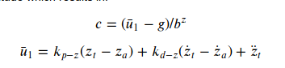

# Writeup

The 3D Drone exercise from the classroom is a very good starting point for most
of the functions, although there are some calculations involved.

## Animation result:

## Scenario 1
A simple tune of the `Mass` parameter will be enough to pass.

## Scenario 2
### 1. Body rate control:

Function `BodyRateControl()`: [source code](./src/QuadControl.cpp#L92-L117)
Calculate the moments with the help of the following equation:

Function `GenerateMotorCommands()` [source code](./src/QuadControl.cpp#L56-L90)
Calculate the desired thrust for each motor with the help of the following equations:

Parameter tuning:
`kpPQR`

### 2. Roll / Pitch control:
Function `RollPitchControl()`: [source code](./src/QuadControl.cpp#L120-L165)
It involves some calculations as well:

Parameter tuning:
`kpBank`

## Scenario 3

### Position and Altitude:
Function `LateralPositionControl()`: [source code](./src/QuadControl.cpp#L214-L262)

Function `AltitudeControl()`: [source code](./src/QuadControl.cpp#L167-L211)
Solving the equation:

Parameter tuning:
`kpPosZ`, `kpPosZ`, `kpVelXY` and `kpVelZ`

### Yaw:
Function `YawControl`: [source code](./src/QuadControl.cpp#L265-L293)

### Parameters tuning:
`kpYaw` and `kpPQR`

## Scenario 4
Function `AltitudeControl()`: [source code](./src/QuadControl.cpp#L167-L211)
Added the integratedAltitudeError, storing the error over time.

## Scenario 5-8:
WIP still need some parameter tuning.